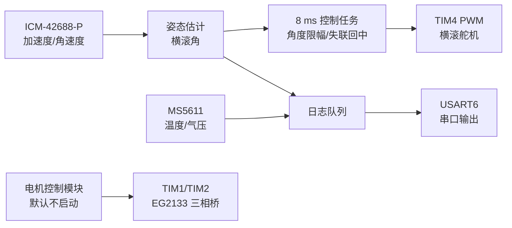

# 仿生鸟控制板工程（bird001）

这是一个基于 **STM32F405RGT6** 的仿生鸟控制板固件与开发板工程。仓库提供可构建的固件源码、CubeMX 配置和嘉立创 EDA 专业版 `.epro2` 工程，便于复现设计和继续开发。

> **当前状态：开发与台架验证阶段。** 固件上电后运行 IMU、气压计、横滚舵机控制和串口日志；无刷电机默认**不自动启动**。构建通过不代表整机已完成飞行验证。

## 先看这张图



设计主线是：**先稳定采集姿态，再用最新有效的横滚角修正舵机；将电机调试留在独立模块中。** 详细思路见 [设计思路](docs/设计思路.md)。

## 仓库内容

| 路径 | 内容 |
| --- | --- |
| `Core/APP/` | FreeRTOS 任务、横滚控制、故障回中、日志 |
| `Core/BSP/` | ICM-42688-P、MS5611、舵机、无刷电机及 SBUS 驱动 |
| `Core/Src/`、`Core/Inc/` | CubeMX 初始化与应用入口 |
| `Drivers/`、`Middlewares/` | STM32 HAL/CMSIS 与 FreeRTOS 依赖 |
| `bird001.ioc` | STM32CubeMX 引脚与外设配置 |
| `hardware/bird006_2026-09-13.epro2` | 开发板原理图/PCB 源工程 |
| `tests/` | 应用逻辑的 ARM 模拟测试 |

## 快速构建

需要 **CMake 3.22+、Ninja、Arm GNU Toolchain（`arm-none-eabi-gcc`）**，并把工具加入 `PATH`。

```sh
cmake --preset Debug
cmake --build --preset Debug
```

输出为 `build/Debug/bird001.elf`。Release 可将 `Debug` 改成 `Release`。烧录需要 ST-LINK 和 STM32CubeProgrammer；请先阅读 [构建与验证](docs/构建与验证.md) 和 [硬件核对](docs/硬件核对.md)。

## 默认运行行为

- ICM-42688-P 经 I2C2 约每 8 ms 读取一次；根据加速度和角速度估计姿态。
- 横滚控制任务约每 8 ms 取最新样本，映射到舵机的 0～145°；样本无效或超过 40 ms 时回到 72.5° 中位。
- MS5611 经 I2C1 约每 20 ms 读取气压与温度。
- USART6 以 115200、8N1 输出 `I`（姿态）和 `P`（气压）记录。
- 无刷电机执行初始化，但 `BLDC_AUTOSTART=0`；SBUS 驱动已包含在源码中，当前应用入口没有启用接收和遥控控制链路。

这些周期是**正常运行时的任务计划周期**，不是硬件故障时的完成时间保证。

## 硬件注意事项

随附板图中的 EG2133 自举供电节点需要核对：现有设计资料指出 `VB1/VB2/VB3` 与 `VCC` 共用 `EG_CP`。在实板核实并修正每相独立自举供电前，请保持电机自动启动关闭。反电动势闭环分支还要求改造三路 ADC 分压/滤波网络，默认的 `BLDC_BEMF_HARDWARE_READY=0` 不能随意改为 1。具体引脚、原因和检查步骤见 [硬件核对](docs/硬件核对.md)。

## 阅读顺序

1. [设计思路](docs/设计思路.md)：模块关系、任务调度、控制逻辑。
2. [硬件核对](docs/硬件核对.md)：接口表和电机电路的限制。
3. [构建与验证](docs/构建与验证.md)：复现构建、串口观察、测试边界。
4. [Core/APP/README.md](Core/APP/README.md)：FreeRTOS 实现细节。

## 许可证

原创代码、文档和板图按 [MIT License](LICENSE) 发布。仓库内 STM32 HAL/CMSIS 与 FreeRTOS 仍遵守各自原有许可证，见 [第三方组件](docs/第三方组件.md)。
